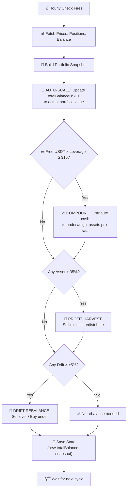

# 📈 STRATEGY: Compound Investment & Auto-Scale Portfolio Manager

> **Bot:** stock-portfolio-manager  
> **Mode:** Binance Futures (3× Leverage)  
> **Philosophy:** Never leave money idle — compound every dollar back into the portfolio.  
> **Date:** April 15, 2026

---

## Table of Contents

1. [Problem Statement](#1-problem-statement)
2. [Solution: Compound + Auto-Scale](#2-solution-compound--auto-scale)
3. [Three Pillars of the Strategy](#3-three-pillars-of-the-strategy)
4. [Detailed Flow](#4-detailed-flow)
5. [Configuration Parameters](#5-configuration-parameters)
6. [Worked Example](#6-worked-example)
7. [Safety Mechanisms](#7-safety-mechanisms)

---

## 1. Problem Statement

### Before (the old behavior)

The original bot operated as a **passive rebalancer**:

- It only checked drift thresholds (±5%) and profit harvest ceilings (35%).
- **Free USDT just sat in the account doing nothing** — even $50+ of idle cash.
- Positions at +10%, +20%, +30% with 3× margin? **No gains were collected or reinvested.**
- The `totalBalanceUSDT` in config was **hardcoded at initialization time** ($1,184.28) and never updated.
- The portfolio couldn't grow because the bot didn't know it had grown.

### The Result

> You had positions up +10% and +20% with 3× leverage, but **no gains were compounded**.  
> Free balance was accumulating but never put to work.  
> The portfolio was effectively capped at its initial size.

---

## 2. Solution: Compound + Auto-Scale

The bot now has **three active mechanisms** that work together every cycle:

```
┌────────────────────────────────────────────────────────────────┐
│                    EVERY REBALANCE CYCLE                       │
│                                                                │
│  1️⃣  AUTO-SCALE: Update totalBalanceUSDT to actual portfolio  │
│       value (positions + free cash × leverage)                 │
│       → The bot "knows" it has grown                           │
│                                                                │
│  2️⃣  COMPOUND: If free USDT ≥ $10 (÷ leverage for margin),   │
│       invest it proportionally across all assets               │
│       → No idle cash                                           │
│                                                                │
│  3️⃣  REBALANCE: Then check drift & profit harvest as usual    │
│       → Keep allocations in line                               │
└────────────────────────────────────────────────────────────────┘
```

---

## 3. Three Pillars of the Strategy

### Pillar 1: Auto-Scale (`totalBalanceUSDT` update)

**What:** Before any analysis, the bot recalculates the _actual_ portfolio value:

```
actualValue = Σ(position_qty × mark_price) + (freeUSDT × leverage)
```

**Why:** If the config says `totalBalanceUSDT = 1184.28` but your positions are now worth $1,400 notional, the bot was calculating target allocations against the old $1,184 — leaving $216 of potential value unused.

**How it works:**

- Every cycle, after fetching the snapshot, the engine compares
  `snapshot.totalValueUSDT` vs `config.totalBalanceUSDT`
- If the actual value is larger, the config is temporarily updated for that cycle
- The state file records the new high-water mark
- Target allocations are now calculated against the **real, current** portfolio size

### Pillar 2: Compound Investment (Free Cash Deployment)

**What:** Any free USDT balance ≥ $10 is automatically distributed across assets proportionally to fill their target allocations.

**Why:** On Binance Futures with 3× leverage, $10 of free margin → $30 notional buying power. Leaving it idle means you're missing compounding.

**How it works:**

1. The engine checks `snapshot.freeUSDT` (actual margin, not notional)
2. If `freeUSDT × leverage ≥ $10` notional ($3.33+ actual margin at 3×):
   - Calculate how much each asset is **below** its target weight
   - Distribute the free cash **pro-rata** to underweight assets
   - Each compound buy gets reason: `"COMPOUND_INVEST"`
3. Minimum buy threshold: $5 notional per asset (Binance minimum)
4. If all assets are at or above target, distribute equally

**Key formula:**

```
compoundBudget = freeUSDT × leverage  (notional purchasing power)

For each underweight asset:
   deficit = targetValue - currentValue
   share   = (deficit / totalDeficit) × compoundBudget
   buyAmt  = min(share, deficit)  // don't overshoot target
```

### Pillar 3: Rebalance + Profit Harvest (unchanged, but now more effective)

The existing drift detection and profit harvest logic still runs **after** compounding:

| Mechanism           | Trigger                      | Action                                    |
| ------------------- | ---------------------------- | ----------------------------------------- |
| **Profit Harvest**  | Any asset > 35% of portfolio | Sell excess → redistribute to underweight |
| **Drift Rebalance** | Any asset drift > ±5%        | Sell overweight → buy underweight         |
| **Compound (NEW)**  | Free USDT ≥ $10 notional     | Buy underweight assets proportionally     |

**Why this is now more effective:** Because `totalBalanceUSDT` auto-scales, the target values grow with the portfolio. The drift thresholds and profit harvest ceiling are calculated against the real portfolio size, not the initial one.

---

## 4. Detailed Flow



### Execution Order Matters

1. **Auto-scale first** — so all calculations use the real portfolio size
2. **Compound second** — deploy idle cash before checking drift
3. **Profit harvest third** — highest priority corrections
4. **Drift rebalance last** — fine-tune allocations

This order ensures gains are captured AND reinvested in a single cycle.

---

## 5. Configuration Parameters

### Current Config (`config_longterm.json`)

```json
{
  "totalBalanceUSDT": 1184.28, // ← Auto-scales up each cycle
  "assets": [
    { "symbol": "MUUSDT", "targetWeight": 0.25 },
    { "symbol": "TSMUSDT", "targetWeight": 0.2 },
    { "symbol": "GOOGLUSDT", "targetWeight": 0.2 },
    { "symbol": "NVDAUSDT", "targetWeight": 0.2 },
    { "symbol": "AAPLUSDT", "targetWeight": 0.15 }
  ],
  "driftThresholdPct": 5, // Rebalance if drift > ±5%
  "profitHarvestCeilingPct": 35, // Auto-sell if asset > 35% of portfolio
  "rebalanceIntervalSeconds": 604800, // 7 days between trade windows
  "leverage": 3, // 3× futures leverage
  "useFutures": true,
  "dryRun": false,
  "feePct": 0.04, // Taker fee 0.04%
  "compoundThresholdUSDT": 10, // NEW: Compound when free cash ≥ $10 notional
  "autoScale": true // NEW: Auto-update totalBalanceUSDT
}
```

### New Parameters

| Parameter               | Type    | Default | Description                                             |
| ----------------------- | ------- | ------- | ------------------------------------------------------- |
| `compoundThresholdUSDT` | number  | `10`    | Minimum free balance (notional) to trigger compounding  |
| `autoScale`             | boolean | `true`  | Whether to auto-update totalBalanceUSDT to actual value |

---

## 6. Worked Example

### Starting State

- Config `totalBalanceUSDT`: $1,184.28
- Leverage: 3×
- Free USDT (margin): $45.00 → Notional: $135.00
- Positions total notional value: $1,250.00

### Step 1: Auto-Scale

```
actualPortfolioValue = $1,250.00 + ($45.00 × 3) = $1,385.00
config.totalBalanceUSDT was $1,184.28 → auto-scaled to $1,385.00
```

### Step 2: Compound Investment

```
Notional cash available = $45.00 × 3 = $135.00  (≥ $10 threshold ✅)

Current allocations vs NEW targets (based on $1,385.00):
  MUUSDT:    $350.00 (25.3%) → target $346.25 (25.0%) → +$3.75 over ❌
  TSMUSDT:   $260.00 (18.8%) → target $277.00 (20.0%) → deficit $17.00
  GOOGLUSDT: $255.00 (18.4%) → target $277.00 (20.0%) → deficit $22.00
  NVDAUSDT:  $240.00 (17.3%) → target $277.00 (20.0%) → deficit $37.00
  AAPLUSDT:  $145.00 (10.5%) → target $207.75 (15.0%) → deficit $62.75

Total deficit: $138.75
Compound budget: $135.00

Distribution (pro-rata by deficit):
  TSMUSDT:   $17.00 / $138.75 × $135.00 = $16.54  → BUY
  GOOGLUSDT: $22.00 / $138.75 × $135.00 = $21.40  → BUY
  NVDAUSDT:  $37.00 / $138.75 × $135.00 = $35.98  → BUY
  AAPLUSDT:  $62.75 / $138.75 × $135.00 = $61.08  → BUY
```

### Step 3: After Compound

All $135 is now deployed. Free USDT ≈ $0. All assets closer to their target weights.

### Step 4: Drift/Harvest Check

With all cash deployed, the portfolio is well-balanced. No further action needed.

### Net Effect

- **Before:** $45 sitting idle in margin, positions unchanged
- **After:** $135 notional distributed across 4 underweight assets, portfolio fully utilized

---

## 7. Safety Mechanisms

### Minimum Thresholds

| Check                   | Value | Purpose                             |
| ----------------------- | ----- | ----------------------------------- |
| Minimum compound amount | $10   | Don't waste fees on tiny trades     |
| Minimum per-asset buy   | $5    | Binance minimum notional            |
| Fee filter              | < 5%  | Skip trades where fee > 5% of value |

### Auto-Scale Safeguards

- **Only scales UP, never down** — if portfolio drops, `totalBalanceUSDT` stays at the last high-water mark to avoid panic selling
- **Capped at 2× initial value per cycle** — prevents a single price spike from causing massive over-allocation
- **State file records scaling history** — full audit trail

### Compound Safeguards

- **Sell orders always execute before buys** — ensures margin is available
- **Budget balancing** — total buys never exceed available funds
- **Cooldown applies** — compounding respects the rebalance interval timer
- **Dry-run mode** — test everything before going live

### Position Sizing with Leverage

Important: With 3× leverage:

- $10 free margin → $30 notional buying power
- The bot calculates in **notional** terms but sends **margin-aware** quantities
- You only need ~$3.33 in actual free balance to compound $10 notional

---

## Summary

The compound + auto-scale strategy transforms the portfolio manager from a **passive rebalancer** into an **active growth engine**:

| Aspect           | Before                  | After                            |
| ---------------- | ----------------------- | -------------------------------- |
| Free cash        | Sits idle               | Auto-invested when ≥$10 notional |
| Portfolio size   | Fixed at initialization | Scales up with gains             |
| Gain collection  | Only at 35% ceiling     | Continuous via auto-scale        |
| Growth potential | Linear (capped)         | Exponential (compound)           |
| Idle capital     | Common                  | Near zero                        |

> **Bottom line:** Every dollar works. Every gain is recognized. The portfolio grows with your positions.
