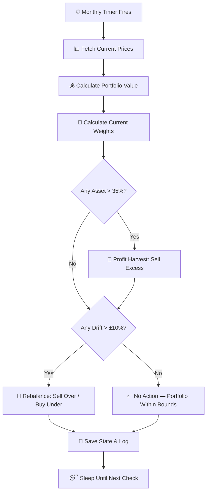

# 📋 Implementation Plan: Long-Term "HODL-Style" Smart Rebalancer Bot

> **Project:** `stock-portfolio-manager` (within `trading-bots` monorepo)
> **Target:** Binance Futures — Stock Token Pairs
> **Architecture:** Clean Architecture (Hexagonal) — matching the existing `momentum-sniper` bot pattern
> **Language:** TypeScript | **Runtime:** Node.js (ts-node)
> **Date:** April 9, 2026

---

## Table of Contents

1. [Overview & Strategy Recap](#1-overview--strategy-recap)
2. [Architecture & Folder Structure](#2-architecture--folder-structure)
3. [Phase 1 — Domain Layer (Models & Interfaces)](#3-phase-1--domain-layer)
4. [Phase 2 — Domain Services (Rebalancing Engine)](#4-phase-2--domain-services)
5. [Phase 3 — Application Layer (Use Cases & Ports)](#5-phase-3--application-layer)
6. [Phase 4 — Infrastructure Layer (Adapters)](#6-phase-4--infrastructure-layer)
7. [Phase 5 — Presentation Layer (CLI Entry Point)](#7-phase-5--presentation-layer)
8. [Phase 6 — Configuration & Environment](#8-phase-6--configuration--environment)
9. [Phase 7 — State Persistence & Recovery](#9-phase-7--state-persistence--recovery)
10. [Phase 8 — Logging & Monitoring](#10-phase-8--logging--monitoring)
11. [Phase 9 — Testing Strategy](#11-phase-9--testing-strategy)
12. [Phase 10 — Build, Deployment & Scheduling](#12-phase-10--build-deployment--scheduling)
13. [Risk Register & Mitigations](#13-risk-register--mitigations)
14. [Task Checklist](#14-task-checklist)

---

## 1. Overview & Strategy Recap

### 1.1 Goal

Build a **low-frequency, long-term portfolio rebalancer** that holds a basket of stock tokens on Binance Futures, periodically checking allocations and rebalancing only when drift exceeds configurable thresholds. The bot follows a "HODL-style" philosophy — **minimize trading, maximize compound growth**.

### 1.2 Portfolio Composition

| Asset | Symbol (Binance) | Target Weight | Allocated (of $4,000) |
| ----- | ---------------- | ------------- | --------------------- |
| MU    | `MUUSDT`         | 25.0%         | $1,000.00             |
| TSM   | `TSMUSDT`        | 20.0%         | $800.00               |
| GOOGL | `GOOGLUSDT`      | 20.0%         | $800.00               |
| NVDA  | `NVDAUSDT`       | 20.0%         | $800.00               |
| AAPL  | `AAPLUSDT`       | 15.0%         | $600.00               |

### 1.3 Selection Methodology

Assets were scored using a **combined score** formula:

```
Combined Score = (1Y Return × 0.70) + (3M Return × 0.30)
```

| Symbol | 1-Year Return (%) | 3-Month Return (%) | Combined Score |
| ------ | ----------------- | ------------------ | -------------- |
| MU     | 522.06            | 4.52               | 366.80         |
| TSM    | 162.00            | 5.23               | 114.97         |
| GOOGL  | 120.06            | 8.58               | 86.62          |
| NVDA   | 89.12             | 10.31              | 65.48          |
| AAPL   | 50.81             | 10.38              | 38.68          |
| AMZN   | 29.64             | 3.64               | 21.84          |

> [!NOTE]
> AMZN was excluded from the final portfolio due to its comparatively low combined score. AAPL is retained for stability and diversification despite a lower score.

### 1.4 Rebalancing Rules

| Rule                       | Value         | Description                                                                 |
| -------------------------- | ------------- | --------------------------------------------------------------------------- |
| **Drift Threshold**        | ±10% absolute | Rebalance only when asset weight deviates >10 percentage points from target |
| **Check Interval**         | 30 days       | Bot evaluates portfolio monthly (~2,592,000 seconds)                        |
| **Profit Harvest Ceiling** | 35% weight    | If any single asset exceeds 35% of portfolio, excess is auto-sold           |
| **Redistribution**         | Pro-rata      | Harvested profits are redistributed to under-allocated assets               |

### 1.5 Rebalancing Flow (High-Level)



---

## 2. Architecture & Folder Structure

The bot will follow the **same clean architecture pattern** used by the existing `momentum-sniper` bot, promoting code reuse and consistency across the monorepo.

### 2.1 Target Folder Structure

```
src/stock-portfolio-manager/
├── plan.md                          ← This file
├── domain/
│   ├── models/
│   │   ├── PortfolioConfig.ts       ← Portfolio config (assets, weights, thresholds)
│   │   ├── AssetAllocation.ts       ← Single asset: symbol, target weight, current weight, value
│   │   ├── PortfolioSnapshot.ts     ← Full portfolio state at a point in time
│   │   ├── RebalanceAction.ts       ← Describes a single buy/sell rebalance action
│   │   └── RebalanceResult.ts       ← Result of a rebalancing cycle (actions taken + summary)
│   └── services/
│       └── RebalancingEngine.ts     ← Pure domain logic: drift detection, harvest, rebalance calc
│
├── application/
│   ├── ports/
│   │   ├── IPortfolioDataProvider.ts ← Interface: get positions, prices, balances
│   │   ├── ITradeExecutor.ts        ← Interface: execute buy/sell market orders
│   │   ├── IStateStore.ts           ← Interface: save/load bot state
│   │   └── ILogger.ts              ← Interface: structured logging
│   └── usecases/
│       ├── RunRebalanceCheckUseCase.ts  ← Orchestrates a single rebalance check cycle
│       └── InitializePortfolioUseCase.ts ← First-time portfolio setup & initial buys
│
├── infrastructure/
│   ├── adapters/
│   │   ├── BinanceFuturesPortfolioAdapter.ts  ← Implements IPortfolioDataProvider + ITradeExecutor
│   │   ├── FileStateStore.ts                   ← JSON file-based state persistence
│   │   └── ConsoleLogger.ts                    ← Console logger with timestamps
│   └── config/
│       └── config_longterm.json                ← Default configuration file
│
└── presentation/
    └── cli/
        ├── run_rebalancer.ts           ← Main entry point (long-running loop or single-shot)
        └── dry_run.ts                  ← Dry-run mode: simulate without executing trades
```

### 2.2 Shared Code Reuse

The following shared modules from `src/shared/` will be reused:

| Module      | Path                            | Usage                       |
| ----------- | ------------------------------- | --------------------------- |
| `MathUtils` | `src/shared/utils/MathUtils.ts` | Rounding, precision helpers |

The existing `BinanceOrderExecutionService` from `momentum-sniper` provides a reference implementation for Binance API interactions (time sync, exchange info, order execution). We will **create a new adapter** specific to the portfolio rebalancer's needs rather than directly coupling to the momentum-sniper's bot.

---

## 3. Phase 1 — Domain Layer (Models & Interfaces)

> **Goal:** Define all data structures and value objects. Zero external dependencies.

### 3.1 `PortfolioConfig.ts`

```typescript
export interface AssetConfig {
  symbol: string; // e.g., "MUUSDT"
  targetWeight: number; // e.g., 0.25 (25%)
}

export interface PortfolioConfig {
  totalBalanceUSDT: number; // e.g., 4000
  assets: AssetConfig[]; // Array of asset configs
  driftThresholdPct: number; // e.g., 10 (means ±10%)
  profitHarvestCeilingPct: number; // e.g., 35 (auto-sell if weight > 35%)
  rebalanceIntervalSeconds: number; // e.g., 2592000 (30 days)
  leverage: number; // e.g., 1 (spot-like)
  useFutures: boolean; // true for Binance Futures
  dryRun: boolean; // if true, log but don't execute
  feePct: number; // e.g., 0.04 (taker fee)
}
```

**Key Design Decisions:**

- `driftThresholdPct` is in **absolute percentage points**, not relative. A 20% target with a 10% threshold means rebalancing triggers at <10% or >30% actual weight.
- `profitHarvestCeilingPct` is a **hard cap** independent of target weight.
- `leverage` defaults to `1` for spot-like behavior on futures.

### 3.2 `AssetAllocation.ts`

```typescript
export interface AssetAllocation {
  symbol: string; // e.g., "MUUSDT"
  targetWeight: number; // e.g., 0.25
  currentWeight: number; // e.g., 0.31 (calculated)
  currentValueUSDT: number; // e.g., 1240.00
  targetValueUSDT: number; // e.g., 1000.00
  positionQty: number; // e.g., 8.5 (number of contracts/coins)
  currentPrice: number; // e.g., 145.88 (latest price)
  driftPct: number; // e.g., 6.0 (currentWeight - targetWeight in pct points)
}
```

### 3.3 `PortfolioSnapshot.ts`

```typescript
import { AssetAllocation } from "./AssetAllocation";

export interface PortfolioSnapshot {
  timestamp: number; // Unix ms
  totalValueUSDT: number; // Sum of all positions + free USDT
  freeUSDT: number; // Unallocated cash
  allocations: AssetAllocation[]; // Per-asset breakdown
  isBalanced: boolean; // true if all assets within threshold
}
```

### 3.4 `RebalanceAction.ts`

```typescript
export interface RebalanceAction {
  symbol: string;
  side: "BUY" | "SELL";
  amountUSDT: number; // Dollar amount to trade
  quantityAsset: number; // Actual quantity in asset units
  reason: "DRIFT_REBALANCE" | "PROFIT_HARVEST" | "REDISTRIBUTION";
  fromWeight: number; // Current weight before action
  toWeight: number; // Expected weight after action
}
```

### 3.5 `RebalanceResult.ts`

```typescript
import { RebalanceAction } from "./RebalanceAction";
import { PortfolioSnapshot } from "./PortfolioSnapshot";

export interface RebalanceResult {
  timestamp: number;
  snapshotBefore: PortfolioSnapshot;
  actions: RebalanceAction[];
  totalFeesEstimated: number;
  rebalanceTriggered: boolean;
  profitHarvestTriggered: boolean;
  summary: string; // Human-readable summary
}
```

---

## 4. Phase 2 — Domain Services (Rebalancing Engine)

> **Goal:** Implement **pure** rebalancing logic with no I/O. This is the brain of the bot.

### 4.1 `RebalancingEngine.ts`

This is the core service containing all decision-making logic. It takes a `PortfolioSnapshot` and `PortfolioConfig` as input and produces a `RebalanceResult`.

#### Methods

| Method                          | Input                                             | Output              | Description                                                |
| ------------------------------- | ------------------------------------------------- | ------------------- | ---------------------------------------------------------- |
| `analyzePortfolio`              | `snapshot`, `config`                              | `RebalanceResult`   | Main entry: runs full analysis and produces actions        |
| `detectDrift`                   | `allocations`, `threshold`                        | `AssetAllocation[]` | Returns assets whose drift exceeds threshold               |
| `detectProfitHarvest`           | `allocations`, `ceilingPct`                       | `AssetAllocation[]` | Returns assets exceeding the profit ceiling                |
| `calculateRebalanceActions`     | `allocations`, `config`                           | `RebalanceAction[]` | Computes exact buy/sell amounts to restore targets         |
| `calculateProfitHarvestActions` | `overweightAssets`, `underweightAssets`, `config` | `RebalanceAction[]` | Sells excess from overweight, redistributes to underweight |

#### Core Algorithm — `analyzePortfolio`

```
1. INPUT: PortfolioSnapshot (current state) + PortfolioConfig (targets & thresholds)

2. PROFIT HARVEST CHECK (runs first, highest priority):
   FOR each asset in snapshot.allocations:
     IF asset.currentWeight > config.profitHarvestCeilingPct (35%):
       → SELL excess to bring weight down to targetWeight
       → Mark proceeds for redistribution

3. DRIFT DETECTION (runs after harvest adjustments):
   FOR each asset in snapshot.allocations:
     drift = |asset.currentWeight - asset.targetWeight|
     IF drift > config.driftThresholdPct (10%):
       → Flag asset for rebalancing

4. REBALANCE CALCULATION:
   totalPortfolioValue = snapshot.totalValueUSDT
   FOR each flagged asset:
     targetValue = totalPortfolioValue × asset.targetWeight
     currentValue = asset.currentValueUSDT
     delta = targetValue - currentValue
     IF delta > 0: → BUY action (amount = delta)
     IF delta < 0: → SELL action (amount = |delta|)

5. BUDGET BALANCING:
   totalSells = sum of all SELL action amounts
   totalBuys = sum of all BUY action amounts
   IF totalBuys > totalSells + freeUSDT:
     → Scale down BUY actions proportionally to available funds

6. OUTPUT: RebalanceResult with all actions, fees estimate, and summary
```

#### Edge Cases to Handle

| Edge Case                  | Handling                                              |
| -------------------------- | ----------------------------------------------------- |
| Portfolio value = 0        | Skip rebalancing, log warning                         |
| Single asset exceeds 100%  | Cap at available balance, force-sell                  |
| Binance minimum order size | Filter out actions below Binance's min notional (~$5) |
| All assets underweight     | Only redistribute free USDT (no sells available)      |
| Rounding errors            | Use `MathUtils.roundByStep()` for Binance precision   |
| Fee impact on small trades | Skip trades where fee > 5% of trade value             |

---

## 5. Phase 3 — Application Layer (Use Cases & Ports)

> **Goal:** Define the contracts (ports) and orchestrate domain logic with I/O through adapters.

### 5.1 Port Interfaces

#### `IPortfolioDataProvider.ts`

```typescript
export interface PositionInfo {
  symbol: string;
  quantity: number; // Absolute position size
  entryPrice: number; // Average entry price
  markPrice: number; // Current market price
  unrealizedPnl: number;
}

export interface IPortfolioDataProvider {
  /** Get current prices for all symbols */
  getCurrentPrices(symbols: string[]): Promise<Map<string, number>>;

  /** Get all open futures positions */
  getOpenPositions(): Promise<PositionInfo[]>;

  /** Get available USDT balance (free, not in positions) */
  getAvailableBalance(): Promise<number>;

  /** Get total account equity (balance + unrealized PnL) */
  getTotalEquity(): Promise<number>;
}
```

#### `ITradeExecutor.ts`

```typescript
export interface TradeResult {
  orderId: string;
  symbol: string;
  side: "BUY" | "SELL";
  executedQty: number;
  executedPrice: number;
  commission: number;
  status: "FILLED" | "PARTIALLY_FILLED" | "FAILED";
}

export interface ITradeExecutor {
  /** Execute a market order for a given USDT amount */
  executeMarketOrder(
    symbol: string,
    side: "BUY" | "SELL",
    amountUSDT: number,
  ): Promise<TradeResult>;

  /** Set leverage for a futures symbol */
  setLeverage(symbol: string, leverage: number): Promise<void>;

  /** Get exchange info (min notional, step size, tick size) for validation */
  getSymbolConstraints(symbol: string): Promise<{
    minNotional: number;
    stepSize: string;
    tickSize: string;
    minQty: string;
  }>;
}
```

#### `IStateStore.ts`

```typescript
import { RebalanceResult } from "../../domain/models/RebalanceResult";
import { PortfolioSnapshot } from "../../domain/models/PortfolioSnapshot";

export interface BotState {
  lastCheckTimestamp: number;
  lastRebalanceTimestamp: number;
  totalRebalanceCount: number;
  rebalanceHistory: RebalanceResult[];
  lastSnapshot: PortfolioSnapshot | null;
  initialPortfolioValueUSDT: number;
  cumulativeFeesPaid: number;
}

export interface IStateStore {
  load(): Promise<BotState | null>;
  save(state: BotState): Promise<void>;
  exists(): Promise<boolean>;
}
```

#### `ILogger.ts`

```typescript
export interface ILogger {
  info(message: string, data?: Record<string, unknown>): void;
  warn(message: string, data?: Record<string, unknown>): void;
  error(message: string, error?: Error, data?: Record<string, unknown>): void;
  trade(message: string, data?: Record<string, unknown>): void;
}
```

### 5.2 Use Cases

#### `RunRebalanceCheckUseCase.ts`

This is the **main use case** executed on each monthly check. It orchestrates:

```
1. Load last state (or initialize if first run)
2. Check if enough time has passed since last check
3. Fetch current portfolio data (prices, positions, balance)
4. Build PortfolioSnapshot
5. Pass snapshot to RebalancingEngine.analyzePortfolio()
6. If actions are needed AND dryRun is false:
   a. Execute each RebalanceAction via ITradeExecutor
   b. Log results
7. Save updated state
8. Return RebalanceResult
```

**Dependencies (injected via constructor):**

- `IPortfolioDataProvider`
- `ITradeExecutor`
- `IStateStore`
- `ILogger`
- `PortfolioConfig`
- `RebalancingEngine`

#### `InitializePortfolioUseCase.ts`

Used for **first-time setup** to buy into the initial portfolio positions.

```
1. Read config (target allocations)
2. Fetch available USDT balance
3. Calculate buy amounts for each asset based on target weights
4. Execute market buy orders for each asset
5. Save initial state
```

> [!IMPORTANT]
> This use case should only be run ONCE. It includes a safety check — if state already exists, it will refuse to run and prompt the user.

---

## 6. Phase 4 — Infrastructure Layer (Adapters)

> **Goal:** Implement concrete adapters for Binance API, file storage, and logging.

### 6.1 `BinanceFuturesPortfolioAdapter.ts`

Implements both `IPortfolioDataProvider` and `ITradeExecutor`.

**Key implementation details:**

| Concern             | Approach                                                                            |
| ------------------- | ----------------------------------------------------------------------------------- |
| **API Client**      | Use `binance-api-node` package (already installed)                                  |
| **Time Sync**       | Reuse the time-sync pattern from `momentum-sniper`'s `BinanceOrderExecutionService` |
| **Price Fetching**  | `client.futuresPrices()` → filter for our symbols                                   |
| **Positions**       | `client.futuresAccountInfo()` → `.positions` array                                  |
| **Order Execution** | `client.futuresOrder({ type: 'MARKET', ... })`                                      |
| **Leverage**        | `client.futuresLeverage({ symbol, leverage: 1 })` — set to 1× for spot-like         |
| **Symbol Filters**  | `client.futuresExchangeInfo()` → cache and lookup per symbol                        |
| **Rounding**        | Reuse `roundByStep` logic from existing `BinanceOrderExecutionService`              |

**Methods to implement:**

```typescript
class BinanceFuturesPortfolioAdapter
  implements IPortfolioDataProvider, ITradeExecutor
{
  // IPortfolioDataProvider
  async getCurrentPrices(symbols: string[]): Promise<Map<string, number>>;
  async getOpenPositions(): Promise<PositionInfo[]>;
  async getAvailableBalance(): Promise<number>;
  async getTotalEquity(): Promise<number>;

  // ITradeExecutor
  async executeMarketOrder(symbol, side, amountUSDT): Promise<TradeResult>;
  async setLeverage(symbol, leverage): Promise<void>;
  async getSymbolConstraints(symbol): Promise<SymbolConstraints>;

  // Internal helpers
  private async ensureTimeSync(): Promise<void>;
  private async getExchangeInfo(): Promise<ExchangeInfo>;
  private roundByStep(value: number, step: string): string;
}
```

### 6.2 `FileStateStore.ts`

Implements `IStateStore`. Persists bot state to a JSON file on disk.

```typescript
class FileStateStore implements IStateStore {
  constructor(private filePath: string) {}

  async load(): Promise<BotState | null>; // JSON.parse from file
  async save(state: BotState): Promise<void>; // JSON.stringify to file
  async exists(): Promise<boolean>; // fs.existsSync
}
```

**State file location:** `state_rebalancer_longterm.json` in the project root.

**State file format example:**

```json
{
  "lastCheckTimestamp": 1712678400000,
  "lastRebalanceTimestamp": 1712678400000,
  "totalRebalanceCount": 3,
  "initialPortfolioValueUSDT": 4000,
  "cumulativeFeesPaid": 12.48,
  "lastSnapshot": {
    "timestamp": 1712678400000,
    "totalValueUSDT": 4250.00,
    "freeUSDT": 50.00,
    "allocations": [...]
  },
  "rebalanceHistory": [...]
}
```

### 6.3 `ConsoleLogger.ts`

Implements `ILogger`. Structured console output with emoji prefixes and timestamps.

```
[2026-04-09T20:00:00.000Z] 📊 INFO: Portfolio check initiated
[2026-04-09T20:00:01.000Z] 💰 TRADE: SELL 2.5 MUUSDT @ $118.50 ($296.25)
[2026-04-09T20:00:01.500Z] ⚠️ WARN: AAPL drift (8.2%) below threshold (10%), skipping
[2026-04-09T20:00:02.000Z] ❌ ERROR: Failed to execute order for TSMUSDT
```

### 6.4 `config_longterm.json` (Default Configuration)

```json
{
  "totalBalanceUSDT": 4000,
  "assets": [
    { "symbol": "MUUSDT", "targetWeight": 0.25 },
    { "symbol": "TSMUSDT", "targetWeight": 0.2 },
    { "symbol": "GOOGLUSDT", "targetWeight": 0.2 },
    { "symbol": "NVDAUSDT", "targetWeight": 0.2 },
    { "symbol": "AAPLUSDT", "targetWeight": 0.15 }
  ],
  "driftThresholdPct": 10,
  "profitHarvestCeilingPct": 35,
  "rebalanceIntervalSeconds": 2592000,
  "leverage": 1,
  "useFutures": true,
  "dryRun": false,
  "feePct": 0.04
}
```

---

## 7. Phase 5 — Presentation Layer (CLI Entry Point)

> **Goal:** Wire everything together and provide a runnable entry point.

### 7.1 `run_rebalancer.ts` — Main Entry Point

This script supports two execution modes:

#### Mode 1: Single-Shot (Cron-friendly)

```bash
npx ts-node src/stock-portfolio-manager/presentation/cli/run_rebalancer.ts
```

Runs one check cycle, executes trades if needed, saves state, and exits. Designed to be called by an external scheduler (cron, Windows Task Scheduler, or a cloud scheduler).

#### Mode 2: Long-Running Loop

```bash
npx ts-node src/stock-portfolio-manager/presentation/cli/run_rebalancer.ts --loop
```

Runs continuously with a `setInterval` that fires every `rebalanceIntervalSeconds`.

#### Startup Flow

```
1. Load .env file (API_KEY, SECRET_KEY)
2. Load config_longterm.json (portfolio config)
3. Initialize adapters:
   - BinanceFuturesPortfolioAdapter(apiKey, apiSecret)
   - FileStateStore("state_rebalancer_longterm.json")
   - ConsoleLogger()
4. Initialize domain services:
   - RebalancingEngine()
5. Initialize use case:
   - RunRebalanceCheckUseCase(adapter, stateStore, logger, config, engine)
6. Execute use case
7. (If --loop mode) Schedule next check in rebalanceIntervalSeconds
8. (If single-shot mode) Process exit
```

### 7.2 `dry_run.ts` — Simulation Mode

Identical to `run_rebalancer.ts` but forces `config.dryRun = true`. Useful for:

- Validating configuration before going live
- Testing connectivity to Binance API
- Seeing what trades _would_ be executed without risking funds

```bash
npx ts-node src/stock-portfolio-manager/presentation/cli/dry_run.ts
```

### 7.3 NPM Scripts (added to `package.json`)

```json
{
  "scripts": {
    "rebalancer": "ts-node src/stock-portfolio-manager/presentation/cli/run_rebalancer.ts",
    "rebalancer:loop": "ts-node src/stock-portfolio-manager/presentation/cli/run_rebalancer.ts --loop",
    "rebalancer:dry": "ts-node src/stock-portfolio-manager/presentation/cli/dry_run.ts",
    "rebalancer:init": "ts-node src/stock-portfolio-manager/presentation/cli/run_rebalancer.ts --init"
  }
}
```

---

## 8. Phase 6 — Configuration & Environment

### 8.1 Environment Variables

The following variables will be read from `.env` (reusing existing API key setup):

| Variable                 | Required | Default                          | Description           |
| ------------------------ | -------- | -------------------------------- | --------------------- |
| `API_KEY`                | ✅       | —                                | Binance API key       |
| `SECRET_KEY`             | ✅       | —                                | Binance API secret    |
| `REBALANCER_CONFIG_PATH` | ❌       | `config_longterm.json`           | Path to config file   |
| `REBALANCER_STATE_PATH`  | ❌       | `state_rebalancer_longterm.json` | Path to state file    |
| `REBALANCER_DRY_RUN`     | ❌       | `false`                          | Override dry-run mode |

### 8.2 Config Validation

On startup, validate:

- [ ] All `targetWeight` values sum to exactly `1.0` (±0.001 tolerance)
- [ ] All symbols are valid Binance Futures pairs
- [ ] `driftThresholdPct` is between 1 and 50
- [ ] `profitHarvestCeilingPct` > max individual `targetWeight`
- [ ] `rebalanceIntervalSeconds` >= 3600 (minimum 1 hour)
- [ ] `leverage` >= 1

---

## 9. Phase 7 — State Persistence & Recovery

### 9.1 State File Schema

The bot maintains a JSON file with full audit trail:

```typescript
interface BotState {
  version: string; // Schema version for migrations
  lastCheckTimestamp: number; // When the bot last ran
  lastRebalanceTimestamp: number; // When last actual trade was made
  totalRebalanceCount: number; // Lifetime rebalance counter
  initialPortfolioValueUSDT: number; // Starting value for ROI calculation
  cumulativeFeesPaid: number; // Total fees paid across all trades
  lastSnapshot: PortfolioSnapshot; // Latest portfolio state
  rebalanceHistory: RebalanceResult[]; // Audit log (last 12 entries max)
}
```

### 9.2 Recovery Scenarios

| Scenario              | Behavior                                                               |
| --------------------- | ---------------------------------------------------------------------- |
| State file missing    | Treat as first run; prompt for `--init` flag                           |
| State file corrupted  | Log error, create backup, prompt for manual review                     |
| Bot crashes mid-trade | On restart, re-fetch positions from Binance and reconcile with state   |
| Binance API down      | Retry 3 times with exponential backoff (5s, 15s, 45s), then skip cycle |

---

## 10. Phase 8 — Logging & Monitoring

### 10.1 Log Levels

| Level | Emoji | Usage                                          |
| ----- | ----- | ---------------------------------------------- |
| INFO  | 📊    | Portfolio checks, snapshots, no-action results |
| TRADE | 💰    | Order execution, fills, rebalance actions      |
| WARN  | ⚠️    | Drift below threshold, API slowness, retry     |
| ERROR | ❌    | API failure, order rejection, state corruption |

### 10.2 Per-Cycle Log Output

```
═══════════════════════════════════════════════════════════════
[2026-05-09T00:00:00.000Z] 📊 REBALANCER CHECK #4
═══════════════════════════════════════════════════════════════
💰 Portfolio Value: $4,523.18 (+13.08% ROI)
   ├─ MUUSDT:    $1,280.50 (28.3%) [target: 25.0%] drift: +3.3%
   ├─ TSMUSDT:   $920.00  (20.3%) [target: 20.0%] drift: +0.3%
   ├─ GOOGLUSDT: $870.20  (19.2%) [target: 20.0%] drift: -0.8%
   ├─ NVDAUSDT:  $830.48  (18.4%) [target: 20.0%] drift: -1.6%
   ├─ AAPLUSDT:  $590.00  (13.0%) [target: 15.0%] drift: -2.0%
   └─ Free USDT: $32.00
───────────────────────────────────────────────────────────────
✅ No rebalancing needed. Max drift: 3.3% (threshold: 10%)
   Next check: 2026-06-08T00:00:00.000Z
═══════════════════════════════════════════════════════════════
```

---

## 11. Phase 9 — Testing Strategy

### 11.1 Unit Tests (Vitest)

| Test File                   | Target            | Tests                                            |
| --------------------------- | ----------------- | ------------------------------------------------ |
| `RebalancingEngine.test.ts` | Domain logic      | Drift detection, profit harvest, rebalance calcs |
| `PortfolioConfig.test.ts`   | Config validation | Weight sum, threshold bounds, symbol validation  |

#### Key Test Scenarios for `RebalancingEngine`:

1. **No rebalancing needed** — All weights within ±10%
2. **Single asset drifted** — One asset at 32%, needs partial sell
3. **Multiple assets drifted** — Two over, two under
4. **Profit harvest triggered** — One asset at 40%, sell down to 25%
5. **Profit harvest + drift** — Harvest first, then rebalance remaining
6. **Edge: All assets underweight** — Only free USDT available to redistribute
7. **Edge: Zero portfolio value** — Safely handles division by zero
8. **Edge: Below min notional** — Actions below $5 are filtered out
9. **Budget balancing** — Buys scaled down when sells don't cover

### 11.2 Integration Tests (Manual / Semi-automated)

| Test                     | Method                                                         |
| ------------------------ | -------------------------------------------------------------- |
| Binance API connectivity | Run `dry_run.ts`, verify prices and positions are fetched      |
| Order execution          | Execute micro-trade ($5) in testnet or with small real balance |
| State persistence        | Run two consecutive cycles, verify state file updates          |
| Full cycle (dry)         | Run complete cycle in dry-run mode, review output              |

---

## 12. Phase 10 — Build, Deployment & Scheduling

### 12.1 Build Script

Add to `package.json`:

```json
{
  "scripts": {
    "build:rebalancer": "esbuild src/stock-portfolio-manager/presentation/cli/run_rebalancer.ts --bundle --platform=node --outfile=dist/rebalancer.js"
  }
}
```

### 12.2 Scheduling Options

| Method                     | Platform  | Command                                           |
| -------------------------- | --------- | ------------------------------------------------- |
| **Windows Task Scheduler** | Windows   | `node dist/rebalancer.js` every 30 days           |
| **Cron**                   | Linux/Mac | `0 0 1 * * node /path/to/dist/rebalancer.js`      |
| **PM2**                    | Any       | `pm2 start dist/rebalancer.js --cron "0 0 1 * *"` |
| **Long-running mode**      | Any       | `node dist/rebalancer.js --loop` (built-in timer) |

### 12.3 Deployment Checklist

- [ ] Copy `.env` with real API keys to server
- [ ] Copy `config_longterm.json` to server
- [ ] Run `npm run build:rebalancer`
- [ ] Test with `npm run rebalancer:dry` first
- [ ] Set up monitoring/alerting for errors
- [ ] Schedule via preferred method

---

## 13. Risk Register & Mitigations

| #   | Risk                             | Severity    | Mitigation                                                            |
| --- | -------------------------------- | ----------- | --------------------------------------------------------------------- |
| 1   | **API key compromised**          | 🔴 Critical | Use IP-whitelisted API keys with no withdrawal permission             |
| 2   | **Flash crash during rebalance** | 🟡 High     | Use market orders (guaranteed fill), accept slippage                  |
| 3   | **Binance API downtime**         | 🟡 High     | Retry with exponential backoff, skip cycle if persistent              |
| 4   | **Slippage on large orders**     | 🟡 Medium   | For large rebalances, consider splitting into multiple smaller orders |
| 5   | **State file corruption**        | 🟡 Medium   | Backup before write, validate on read, reconcile with Binance         |
| 6   | **Token delisted on Binance**    | 🟡 Medium   | Detect missing symbol, log alert, skip asset                          |
| 7   | **Rounding errors**              | 🟢 Low      | Use `roundByStep` with exchange's step/tick sizes                     |
| 8   | **Fee erosion**                  | 🟢 Low      | Skip trades where fee > 5% of value; monthly frequency minimizes this |
| 9   | **Past performance**             | ⚪ Inherent | Disclaimer: past performance ≠ future results                         |

> [!CAUTION]
> **Live Trading Disclaimer:** This bot is a conceptual framework. Live trading requires thorough testing, risk management, and adherence to Binance's API terms of service. Ensure proper security measures for API keys. Past performance is NOT indicative of future results. All investments carry inherent risks.

---

## 14. Task Checklist

### Phase 1 — Domain Models

- [x] Create `domain/models/PortfolioConfig.ts`
- [x] Create `domain/models/AssetAllocation.ts`
- [x] Create `domain/models/PortfolioSnapshot.ts`
- [x] Create `domain/models/RebalanceAction.ts`
- [x] Create `domain/models/RebalanceResult.ts`

### Phase 2 — Domain Services

- [x] Create `domain/services/RebalancingEngine.ts`
- [x] Write unit tests for `RebalancingEngine` (9 scenarios)

### Phase 3 — Application Layer

- [x] Create `application/ports/IPortfolioDataProvider.ts`
- [x] Create `application/ports/ITradeExecutor.ts`
- [x] Create `application/ports/IStateStore.ts`
- [x] Create `application/ports/ILogger.ts`
- [x] Create `application/usecases/RunRebalanceCheckUseCase.ts`
- [x] Create `application/usecases/InitializePortfolioUseCase.ts`

### Phase 4 — Infrastructure Layer

- [x] Create `infrastructure/adapters/BinanceFuturesPortfolioAdapter.ts`
- [x] Create `infrastructure/adapters/FileStateStore.ts`
- [x] Create `infrastructure/adapters/ConsoleLogger.ts`
- [x] Create `infrastructure/config/config_longterm.json`

### Phase 5 — Presentation Layer

- [x] Create `presentation/cli/run_rebalancer.ts`
- [x] Create `presentation/cli/dry_run.ts`
- [x] Add NPM scripts to `package.json`

### Phase 6 — Configuration

- [x] Add rebalancer env vars to `.env.example`
- [x] Implement config validation logic

### Phase 7 — State Management

- [x] Implement state file schema with versioning
- [x] Implement crash recovery and reconciliation logic

### Phase 8 — Logging

- [x] Implement `ConsoleLogger` with emoji formatting
- [x] Implement per-cycle portfolio dashboard output

### Phase 9 — Testing

- [x] Write all unit tests for `RebalancingEngine`
- [ ] Manual dry-run integration test
- [ ] Test state persistence across restarts

### Phase 10 — Deployment

- [x] Add `build:rebalancer` esbuild script
- [ ] Write deployment documentation
- [ ] Validate with dry-run on production API keys

---

> [!TIP]
> **Recommended Development Order:** Phase 1 → Phase 2 (+ tests) → Phase 3 → Phase 4 → Phase 5 → Phase 6 → Phase 7 → Phase 8 → Phase 9 → Phase 10. Build the pure domain logic first, validate with tests, then wire up infrastructure.
